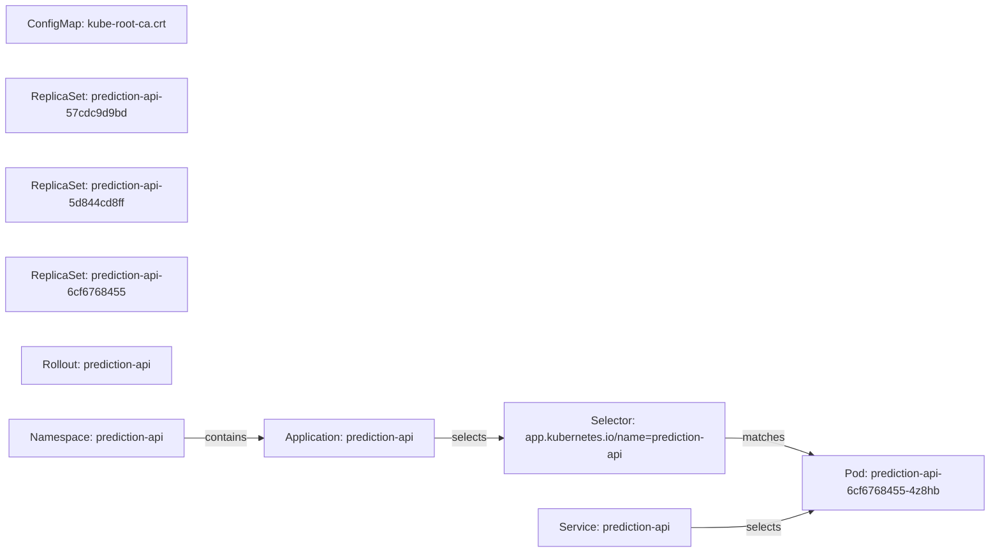

# prediction-api Application Topology

Namespace: `prediction-api`

## Graph

## Application

| name | namespace |
| --- | --- |
| prediction-api | prediction-api |

## ConfigMap

| name |
| --- |
| kube-root-ca.crt |

## Event

| message | object | reason |
| --- | --- | --- |
| Rollout updated to revision 10 | Rollout/prediction-api | RolloutUpdated |
| Rollback to stable ReplicaSets | Rollout/prediction-api | SkipSteps |

## Pod

| name |
| --- |
| prediction-api-6cf6768455-4z8hb |

## ReplicaSet

| name |
| --- |
| prediction-api-57cdc9d9bd |
| prediction-api-5d844cd8ff |
| prediction-api-6cf6768455 |

## Rollout

| name |
| --- |
| prediction-api |

## Selector

| labels |
| --- |
| app.kubernetes.io/name=prediction-api |

## Service

| name |
| --- |
| prediction-api |
